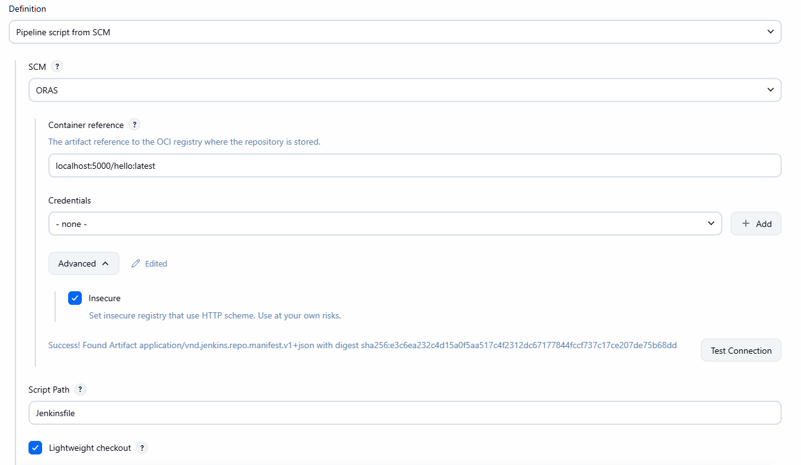
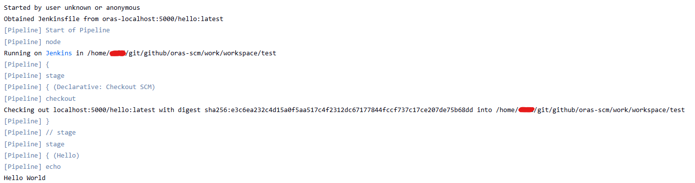

# ORAS SCM Plugin

## Introduction

This plugin provides an SCM (`hudson.scm.SCM`) implementation that checks out a repository packaged as an
OCI artifact and pulled with [ORAS](https://oras.land/).

It is the counterpart to [pipeline-cps-oras](https://plugins.jenkins.io/pipeline-cps-oras/): that plugin lets a
pipeline job fetch its Jenkinsfile from an OCI registry, but jobs configured that way have no SCM attached, so a
`checkout scm` step (implicit at the start of every declarative `agent` block) has nothing to check out. This
plugin fills that gap by making the repository artifact itself a real SCM that Jenkins can check out, poll, and
record against a build, exactly like Git or Subversion.

### Which plugin should I use?

Both plugins can serve a pipeline script packaged as an `application/vnd.jenkins.repo.manifest.v1+json` artifact, and
they are NOT mutually exclusive - a job can use `pipeline-cps-oras` to fetch its Jenkinsfile and this plugin,
separately, to check out the rest of the repository. As a rule of thumb:

- **`pipeline-cps-oras`** is the simpler choice for ad-hoc or generated pipelines where you just need to run a
  script and don't care about SCM semantics.
- **`oras-scm`** (this plugin) is recommended once you are packaging full repositories for regular CI activity,
  because it integrates with Jenkins' existing SCM checkout machinery instead of working around it: `checkout scm`
  (implicit or explicit), changelogs, SCM polling/triggers, lightweight checkout, and the standard SCM dropdowns
  on Freestyle and "Pipeline script from SCM" jobs all work as they would with Git or Subversion.

> [!WARNING]
> The ORAS Java SDK is currently in **beta** state and might impact the stability of this plugin.
>
> Its configuration and APIs might change in future releases.

<p align="left">
<a href="https://oras.land/"></a>
</p>

## Getting started

The plugin registers a new SCM named **ORAS**, selectable anywhere Jenkins lets you pick an SCM: a Freestyle
project's "Source Code Management" section, a Multibranch pipeline, or the SCM dropdown of a "Pipeline script from
SCM" job.

Credentials are optional if using an unsecured registry, otherwise provide a username/password credential.

In order to be checked out, the artifact must have the following media type:
`application/vnd.jenkins.repo.manifest.v1+json`

You can push such an artifact using the [ORAS CLI](https://oras.land/docs/commands/oras_push) from the root of the
repository you want to check out:

```bash
oras push localhost:5000/hello:latest --artifact-type application/vnd.jenkins.repo.manifest.v1+json .
```

The whole content of the artifact is extracted into the build workspace on every checkout, and the manifest
digest is used to detect changes when polling.



### Implicit checkout in a declarative pipeline

In the job configuration, under **Pipeline**, choose the **Pipeline script from SCM** definition, then pick
**ORAS** in the SCM dropdown and fill in the container reference, credentials, and script path (e.g.
`Jenkinsfile`). Because the job now has a real SCM attached, the implicit `checkout scm` that declarative
pipelines perform before the first stage works as expected, populating the workspace with the rest of the
repository too — no explicit `checkout` step needed in the Jenkinsfile itself.

### Explicit checkout step

If your pipeline is not itself SCM-backed (for example when using `pipeline-cps-oras` to fetch the script), you
can still check out a repository artifact explicitly with the generic `checkout` step, either using the
`@Symbol`-based shorthand:

```groovy
pipeline {
    agent any
    stages {
        stage('Checkout') {
            steps {
                checkout oras(containerRef: 'localhost:5000/hello:latest', insecure: true)
            }
        }
        stage('Build') {
            steps {
                sh './build.sh'
            }
        }
    }
}
```



### Freestyle projects

Select **ORAS** in the "Source Code Management" section of a Freestyle project and fill in the container reference,
credentials, and insecure flag as needed.

## Issues

Report issues and enhancements in the [Jenkins issue tracker](https://issues.jenkins.io/).

## Contributing

Refer to our [contribution guidelines](https://github.com/jenkinsci/.github/blob/master/CONTRIBUTING.md)

## LICENSE

Licensed under MIT, see [LICENSE](LICENSE.md)
